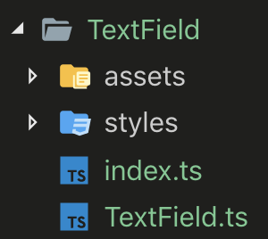

# RC UI

## Install

### package.json

```ts
npm i rcui
// or
yarn add rcui
```

## Using

```tsx
import {
  RuiAvatar,
  RuiTooltip,
  RuiButton,
  RuiIconography,
  RuiLink,
  RuiCircularProgress,
  ThemeProvider,
} from 'rcui';
```

```html
<ThemeProvider>
  <div>
    <RuiTooltip title="children">
      <div>children</div>
    </RuiTooltip>
    <RuiAvatar color="lake">SH</RuiAvatar>
    <RuiAvatar color="lake">SH</RuiAvatar>
    <RuiButton>Cool</RuiButton>
    <RuiButton variant="round">Button</RuiButton>
    <RuiIconography icon="star" />
    <RuiLink>123456</RuiLink>
    <RuiCircularProgress />
    <RuiCircularProgress size="{30}" color="secondary" />
  </div>
</ThemeProvider>
```

## Coding Style Guideline

We base on `styled-component` and `material-ui` to implement our RCUI library currently, we should separate the file in a different folder, let can make our code more readable and independent.

### Rules:

1. All about material-UI base component we should put that in the `styles` folder in target component,

- The `styled` component to contain the material component with custom `styled`, make we using that like our custom component, and name format should be `Styled[Name]`, make that short and readable, example: `StyledIcon`.
   ```ts
  export { StyledIcon };
  ```
2. Example compoent structure:

* `styles`: styled component wrapper.
* `assets`: all resource using in component, like `.png, .svg...`
* `index.ts`: all component and method want to export should be export with `index.ts` below `[ComponentName]` root folder.
* `TextField.ts`: the target component.
3. Component export needs at least `{Rui[Name], Rui[Name]Props}`, and others should start with `Rui[Name]` like below.
```ts
export { RuiButton, RuiButtonProps };
````

4. Make the component small and readable.
5. Make sure all props from material contain in the

6. The `Props` from material and our custom should be separated into two types, and export that using `&` like below.

```ts
type RuiBaseTextFieldProps = Pick<SomeProps, 'props1' | 'props2' | 'props3'>

type RuiTextFieldProps = {
myCustomProps?: any;
...
} & RuiBaseTextFieldProps;
// using & to merge that props
```

1. `RuiBase[ComponentName]Props`: contain all export Props from material.
2. `Rui[ComponentName]Props`: contain all export Props we design.

<br>
<br>
<br>

# Debug with vscode

## Launch Debug

```bash
ctrl + shift + p
```

Typing `task` and choice `Run Storybook`, that will serve the application.

Press `F5` to run `Launch Chrome` and you can using vscode debug in the IDE now.

## Attach Debug

**_Before you using attach debug, you should close all of chrome, and using terminal to open chrome._**

```bash
ctrl + shift + p
```

Typing `task` and choice `Open debug browser`, that will open the browser in the debug mode.

Press `F5` to run `Attach Browser` and you can using vscode debug in the IDE now.
