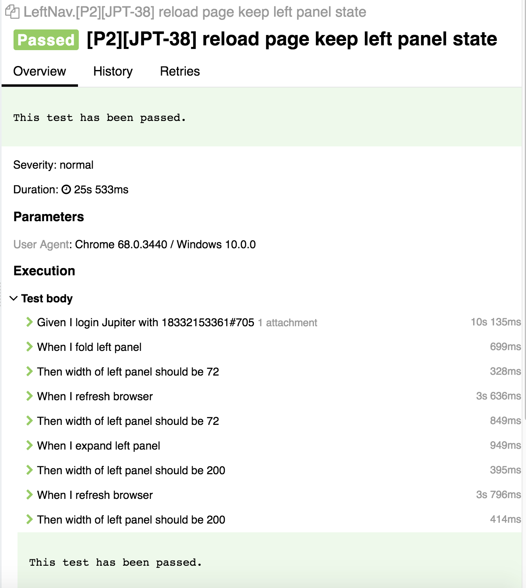

# E2E测试文档 #

## 示例 ##

``` typescript

import * as faker from 'faker/locale/en';
import { v4 as uuid } from 'uuid';

import { formalName } from '../../libs/filter';
import { h } from '../../v2/helpers'
import { setupCase, teardownCase } from '../../init';
import { AppRoot } from "../../v2/page-models/AppRoot";
import { SITE_URL } from '../../config';

fixture('Send Messages')
  .beforeEach(setupCase('GlipBetaUser(1210,4488)'))
  .afterEach(teardownCase());

test(formalName('send', ['P0', 'JPT-77', 'Enter text in the conversation input box']), async (t) => {
  const users = h(t).rcData.mainCompany.users;

  const user = users[3];
  const app = new AppRoot(t);

  await h(t).withLog(`Given I login Jupiter with ${user.company.number}#${user.extension}`, async () => {
    await h(t).directLoginWithUser(SITE_URL, user);
    await app.homePage.ensureLoaded();
  });

  await h(t).withLog('When I enter a conversation', async () => {
    await app.homePage.messagePanel.directMessagesSection.expand();
    await app.homePage.messagePanel.directMessagesSection.nthConversationEntry(0).enter();
  });

  const identifier = uuid();
  const message = `${faker.lorem.sentence()} ${identifier}`;

  const conversationSection = app.homePage.messagePanel.conversationSection;
  await h(t).withLog('Then I can send message to this conversation', async () => {
    await conversationSection.sendMessage(message);
  });

  await h(t).withLog('And I can read this message from post list', async () => {
    await t.expect(conversationSection.posts.child().withText(identifier).exists).ok();
  }, true);
});
```

## 编写测试 ##

### 模版 ###

可以使用以下模版做为所有测试的起点

```typescript
import { formalName } from '../../libs/filter';
import { h } from '../../v2/helpers'
import { setupCase, teardownCase } from '../../init';
import { AppRoot } from "../../v2/page-models/AppRoot";
import { SITE_URL } from '../../config';

fixture('Fixture Name')
  .beforeEach(setupCase('GlipBetaUser(1210,4488)'))
  .afterEach(teardownCase());

test(formalName('Case1 Name', ['tag1', 'tag2']), async (t) => {
  // steps
});

test(formalName('Case1 Name', ['tag1', 'tag2']), async (t) => {
  // steps
});

// more cases
```

###  Page Model 的使用 ###

重构后的Page Model提供了一个统一的访问入口: AppRoot

在每个测试的开始处通过以下代码初始化一个 AppRoot 实例, 后续即可通过该实例访问页面元素并执行页面操作

```typescript
const app = new AppRoot(t);
```

### 工具库的使用 ###

在编写e2e测试时, 除了可使用 testcafe 提供的 TestController 进行基本的页面操作外, 我们另外提供了一个帮助库h(t), 用于封装 testcafe 的部分常用操作, 以及框架以外的功能, 如SDK, 日志, ...

以下为工具库常用功能的访问方式

```typescript
import { formalName } from '../../libs/filter';
import { setupCase, teardownCase } from '../../init';
import { AppRoot } from "../../v2/page-models/AppRoot";
import { SITE_URL } from '../../config';
import { h } from '../../v2/helpers' // 导入工具库

fixture('Fixture Name')
  .beforeEach(setupCase('GlipBetaUser(1210,4488)'))
  .afterEach(teardownCase());

test(formalName('Case1 Name', ['tag1', 'tag2']), async (t) => {
  /* 测试数据 */
  h(t).rcData; // 测试数据入口
  const user = h(t).rcData.mainCompany.users[0];  // 从测试数据中获取一个用户账号
  
  /* sdk */
  const userPlatform = await h(t).getPlatform(user); // 获取一个以 user 身份登录的 platform sdk实例
  const userGlip = await h(t).getGlip(user);  // 获取一个以 user 身份登录的 glip sdk 实例

  /* 日志 */
  await h(t).log('hello world'); // 向报告写入一条记录
  await h(t).withLog('hello world', async () => {  
    // steps
  });  // 写入一条记录, 自动跟踪执行结果和执行时间

  // ... //

});
```

### 测试数据使用规则 ###

目前 h(t).rcData.mainCompany 中提供了 8 个用户账号, 4个 teams 用于在测试中使用. 为了让测试可以更稳定地运行, 在测试中请遵循如下的测试使用规则

* h(t).rcData.mainCompany.users[0 - 3]: 不可对此账号进行重置操作, 不要变更这些用户的权限/名称
* h(t).rcData.mainCompany.users[4 - 7]: 可以进行重置/
* h(t).rcData.mainCompany.teams: 不要对已存在的team进行更名, 成员变化, 权限变化等操作
* 如果需要执行带状态的操作, 如测试更新 team 名称或成员, 请新建一个 team 进行操作

### 规范测试报告 ###

使用 Given-When-Then 的形式对测试步骤进行描述.

尽量使用 h(t).withLog 方法执行测试步骤并写入报告, 该方法可自动记录步骤时间和执行结果, 帮助我们更好地对测试结果进行分析.

一个较理想的报告示例如下:



### 其它注意事项 ###

* 由于glip sdk 登录速度较慢, 在platform sdk可以满足需求的前提下, 尽可能使用该sdk, 只在必要时使用glip sdk